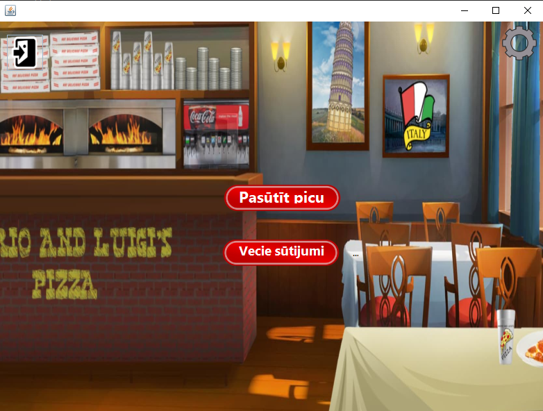
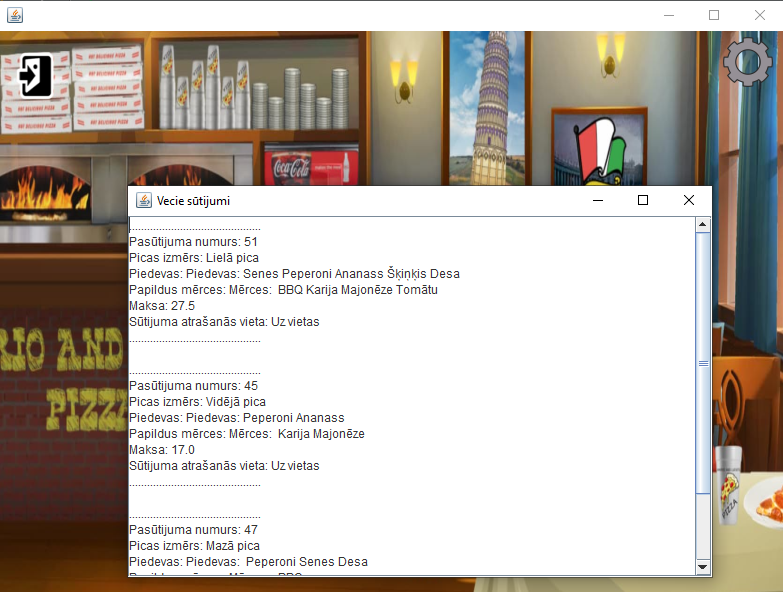
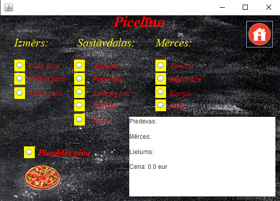
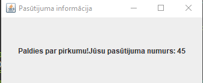
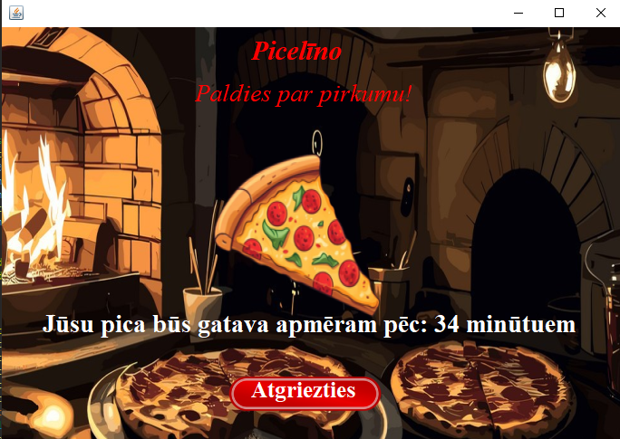
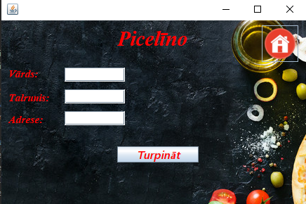
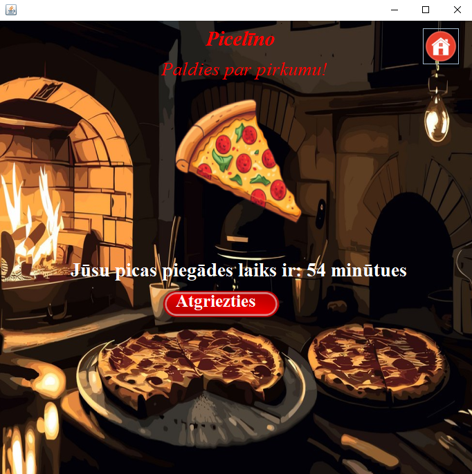

# Projekts "Kliecis-pica"
Picas pasūtīšanas sistēma

## **Darāmo darbu saraksts**

- [x]  Izveidot main menu sistēmu
- [x]  Izveidot picas veidošanas logu
- [x]  Izveidot pogu, kas ļauj atgriezties uz main menu
- [x]  Izveidots picas cenas kalkulātors
- [x]  Programma saglabā sūtijumu
- [x]  Programma izvada pasūtijuma nr
- [x]  Programma prasa ievadīt info, ja pica tiek sūtīta
- [x]  Programma izvada piegādes laiku
- [x]  Lietotājs spēj apskatīt jau klientiem nodotos sūtijumus
 
 
 
Main Menu:

 
Main menu, kur spējam iziet no programmas, ja uzspiežam uz pogu,
kas atrodas kreisajā, augšējā pusē.  
Mums ir 2 ivēles, veidot picu vai apskatīt vecos sūtijumus
 
 
Vecie Sūtijumi:

 
Šeit mēs spējam apskatīt veco klientu sūtijumus
  
Picas Sūtīšana:

Šajā logā mēs spējam izvēleties picas izmēru, sastāvdaļas, piedevas
un picas saņemšanas veidu (uz vietas/ piegāde).
Labajā apakša tiek parādīta picas cena

 
Picas numurs:
  

          Ja izvēlamies picu saņemt uz vietas, mums parādās šads logs,
kas satur picas numuru, lai to saņemtu uz vietas
 
Info, kas tiek saņemts, ja picas saņemšana ir uz vietas:

Šeit mēs redzam logu, kas parāda laiku ap cikiem pica būs gatava.
Mums ir dota opcija atgriezties uz main menu
 
Informācijas ievade:

         Ja pica tiek sūtīta, tad klientam ir jāieraksta info,
lai piegādātājs spētu nodot picu. Šajā logā vārdam ir jābūt vismaz 3 burtiem garam, 
talrunim ir jābut 8 cip un adresei ir jābūt vismaz 5 burtu garai
 
Info par picas piegādes laiku:

Šajā logā ir redzams, pēc cik min pica būs gatava.
Mums ir opcija doties atpakaļ uz main menu logu

